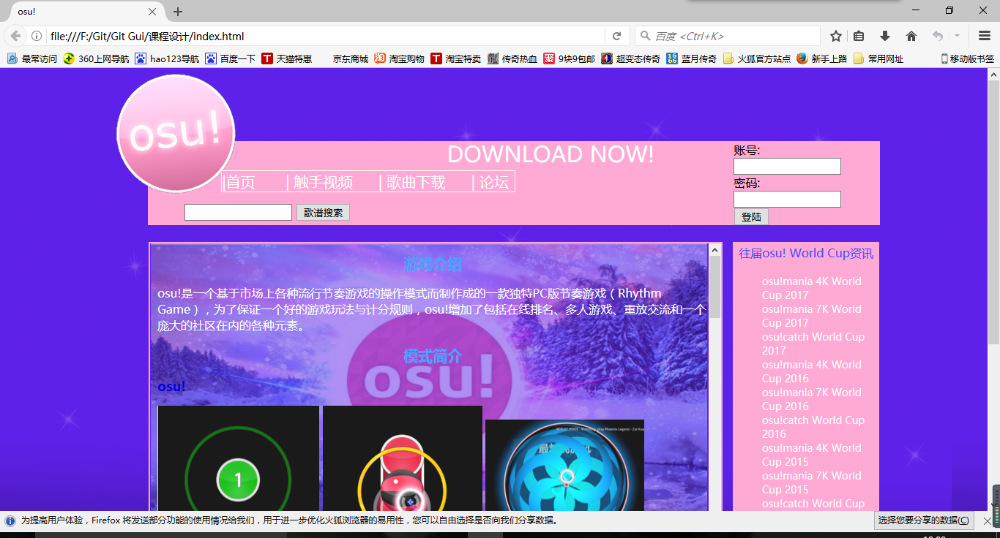

#【osu！中文网】

##设计目的
1.	熟练掌握HTML在组织结构上的优势。
2.	熟练掌握CSS在网页布局中的应用。
3.	学习Web标准及浏览器的兼容性。

##设计步骤

###1.功能性需求分析
该网站共有3个页面，其中每一个页面的屏幕截图及主要功能如下所列。
####（1） 首页：
屏幕截图：
 
图1 首页屏幕截图
####（2)  二级页面：
屏幕截图：
 
图1 列表屏幕截图
####（3)  三级页面：
屏幕截图：
 
图1 内容屏幕截图

###2. 搜集网站素材

###3. 建立网站代码目录结构
 

###4. 编写HTML代码
####（1） 首页部分：

####（2） 二级页面：

####（3） 三级页面：

###5. 编写CSS布局及样式
####（1） CSS布局：
利用float和盒子的自身属性进行整体布局，position辅助布局细节用float难以实现的部分。
####（2） 添加CSS样式：
全部使用外部样式

###6. 调试浏览器兼容性
####（1） 问题1：
IE浏览器中logo无法显示
#####在IE10+中的表现（屏幕截图）：

#####在火狐中的表现（屏幕截图）：

#####在Chrome中的表现（屏幕截图）：

解决方案（核心源代码）：初步认定是因为图像的模式是CMYK模式，如果是这样那么生成的图片即便是jpg格式IE浏览器不显示。因为放入ps中报错，所以采用截图软件截图后再放入ps中处理，多次调节画布大小和图片大小后，在RGB模式下保存为png格式。

##问题记录
1.	问题表现：盒子经过浮动后位置难掌握，只好主要float定位，position辅助细节定位。
2.	问题表现：整体文字样式和局部文字样式不同

##设计总结
1.	需求分析阶段的经验：了解国内大部分用户对音游的陌生程度，和osu的实际普及度，所以从介绍开始写，而不像官网是以一个已经了解游戏的人的角度来编辑。
2.	编写HTML代码的经验：html负责写整体框架，和一些简单的修饰。
3.	CSS布局的经验：复杂或共用的样式一定要通过外部引用css来写，减少代码冗余程度，同时命名一定要清晰且页面之间统一，方便修改。
4.	设置CSS样式经验：要以浏览者的角度来看，结合观感，视觉浏览顺序和刺激程度。重点部分要突出。
5.	调整浏览器兼容性经验：多查百度，不懂的有很多。
6.	Sublime Text使用经验：缩进很重要，严格执行每一次缩进。

##课程小结
1.	HTML内容：
html主要用途是构建页面而不是修饰。目的是为了表达清楚想要表述的内容，和表达的方式，如文字，列表，图片，表单。所以一般不使用html自带样式。
2.	CSS内容：
css是用来装饰html网页，增加内容的可读性和整体的美观性。利用外部样式单独列出这个页面的样式也利于html和css两个文件对照修改。
3.	网上参考的内容：
W3school：http://www.w3school.com.cn/
百度经验-html颜色代码：http://jingyan.baidu.com/article/425e69e69690f0be15fc168a.html
4.	浏览器对CSS的兼容性上的不同表现（你所遇到的）：logo显示不出来

##解决方案
初步认定是因为图像的模式是CMYK模式，如果是这样那么生成的图片即便是jpg格式IE浏览器不显示。因为放入ps中报错，所以采用截图软件截图后再放入ps中处理，多次调节画布大小和图片大小后，在RGB模式下保存位png格式。

##参考文献
1.osu!mania 7K World Cup 2016中国队夺冠详录https://sanwen8.cn/p/16av6K8.html
2.osu百度百科http://baike.baidu.com/item/OSU/17537247#viewPageContent
3.在IE浏览器中无法显示个别图片http://www.iefans.net/ie-wufa-xianshi-gebie-tupian/